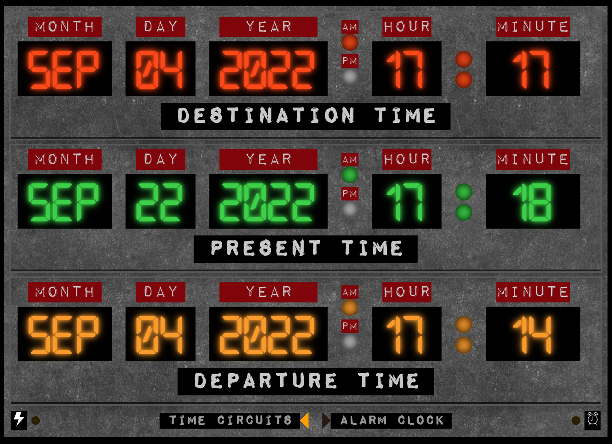

# Back to the Timer
This is a hacked out Prototype. 
Do not expect to much...
I did this as a challenge to myself

## Usage
1. Use the "Destination Time" Row as Input-Fields to set your desired Travel Destination.
2. Press Enter to start the Time Travel
